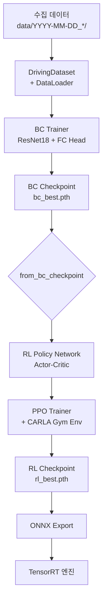

## 1. 개요

숭산텍의 학습 파이프라인은 **BC → RL 2단계**로 구성되며, 각 단계의 산출물(체크포인트)은 SQLite 기반 ExperimentLogger로 추적됩니다.

<!-- more -->

## 2. 전체 학습 흐름



## 3. BC 학습 단계 (Phase 2-A)

| 항목 | 설명 |
|------|------|
| 입력 | Front RGB 224×224 |
| 출력 | (steering, throttle) ∈ [-1, 1] × [0, 1] |
| 학습 데이터 | 1~6시간 분량의 autopilot 주행 로그 |
| 검증 메트릭 | MAE Steering, MAE Throttle, 교차로 통과율 |
| 체크포인트 정책 | 검증 손실 기준 best 저장 |

## 4. RL 학습 단계 (Phase 2-B)

### 4.1 BC Warm-Start

PPO Actor 네트워크는 BC 체크포인트로부터 초기화되며, Critic은 새로 초기화됩니다. 처음 100 에피소드는 backbone을 freeze하여 Critic이 안정화될 시간을 줍니다.

### 4.2 보상 함수

```python
def compute_reward(state, action, next_state):
    # 차선 유지 보상
    lane_reward = 1.0 - min(abs(state.lane_offset), 1.5) / 1.5
    
    # 충돌 페널티
    collision_penalty = -100.0 if next_state.collision else 0.0
    
    # 조향 부드러움
    steering_smoothness = -0.1 * abs(action.steering - state.prev_steering)
    
    # 전진 보상
    forward_reward = 0.01 * (next_state.x - state.x)
    
    return lane_reward + collision_penalty + steering_smoothness + forward_reward
```

### 4.3 PPO 하이퍼파라미터

| 항목 | 값 |
|------|---|
| Learning Rate | 1e-5 (BC fine-tune 시 작게) |
| Clip Range | 0.2 |
| Gamma | 0.99 |
| GAE Lambda | 0.95 |
| Epochs per Update | 10 |
| Batch Size | 256 |
| 학습 에피소드 | 5,000 |

## 5. ExperimentLogger 통합

모든 학습 실험은 SQLite 기반 ExperimentLogger로 추적됩니다.

```python
from src.experiment.experiment_logger import ExperimentLogger

logger = ExperimentLogger(db_path='experiments.db')
exp_id = logger.create_experiment(
    name='bc_resnet18_3h_clear_noon',
    type='BC',
    config={'data_hours': 3, 'weather': 'ClearNoon', 'lr': 1e-4},
)

for epoch in range(50):
    train_loss, val_loss = train_one_epoch(...)
    logger.log_metric(exp_id, 'val_loss', val_loss, step=epoch)

logger.update_status(exp_id, 'completed')
report = logger.generate_markdown_report(exp_id)
```

## 6. 체크포인트 관리

```
checkpoints/
├── bc/
│   ├── bc_3h_clear_best.pth
│   ├── bc_3h_clear_last.pth
│   └── bc_3h_clear_meta.json
└── rl/
    ├── rl_warmstart_bc3h_best.pth
    └── ...
```
