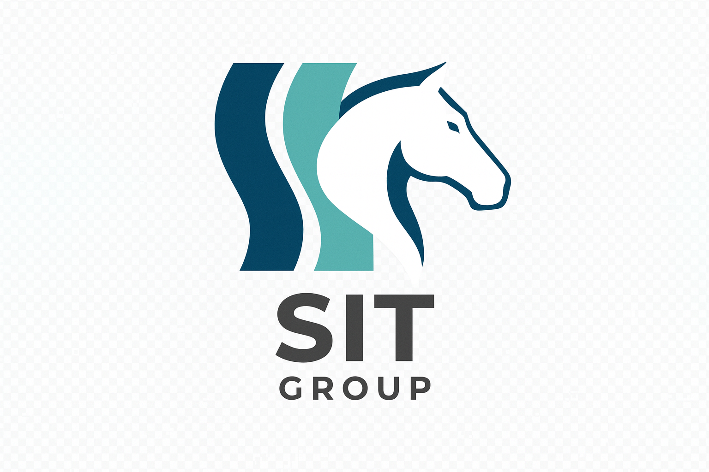

# SoongSanTech (SIT) 소개

  

## 우리는 누구인가

**SoongSanTech (SIT, 숭산텍)**는 인공지능을 활용한 응용 서비스 개발에 주력하는 소규모 연구·개발 그룹입니다. 현재는 **디지털 트윈 환경(CARLA)에서 자율주행 모델을 개발**하고, **Sim-to-Real에 적합한 경량 모델을 연구**하는 데 집중하고 있습니다.

## 우리의 신념

> "새로운 것을 발명하기보다는, 검증된 것들을 잘 조합하여 의미 있는 결과를 만든다."

자원이 제한된 소규모 팀이지만, 명확한 방향성과 체계적인 실증을 통해 학계와 산업계 모두에 가치 있는 기여를 하고자 합니다.

## 운영 원칙

### 1. 투명성 (Transparency)
모든 코드와 연구 과정을 공개합니다. 이 위키와 R&D 로그가 그 대표적 예입니다.

### 2. 재현성 (Reproducibility)
실험은 누구나 동일한 결과를 재현할 수 있도록 환경·시드·하이퍼파라미터를 명시합니다.

### 3. 협업 (Collaboration)
2인 이상의 팀 구성을 전제로, 표준화된 템플릿과 워크플로우로 효율적 협업을 추구합니다.

### 4. 학습 (Continuous Learning)
실패도 학습의 일부로 기록하고, 회고를 통해 다음 단계로 나아갑니다.

## 라이선스

- **사이트 콘텐츠**: [CC BY 4.0](https://creativecommons.org/licenses/by/4.0/deed.ko)
- **소스 코드**: 각 레포지토리의 LICENSE 파일 참조

## 연락

| 항목 | 정보 |
|------|------|
| GitHub | [github.com/SoongSanTech](https://github.com/SoongSanTech) |
| 이메일 | leeroy7321@gmail.com |
| 인스타그램 | [@meng._.ro](https://instagram.com/meng._.ro) |

## 제작 환경

이 사이트는 [MkDocs](https://www.mkdocs.org/) + [Material for MkDocs](https://squidfunk.github.io/mkdocs-material/) 테마로 제작되어 [GitHub Pages](https://pages.github.com/)에 배포됩니다.
