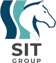

  
  <h1>SoongSanTech (SIT)</h1>
  
인공지능을 활용한 응용 서비스 개발에 주력하며, 현재 디지털 트윈 환경에서 <strong>Sim-to-Real 자율주행 모델</strong>을 연구하고 실증합니다.

-   :material-book-open-page-variant:{ .lg .middle } __지식 위키 (Docs)__

    ---

    자율주행, 강화학습, CARLA 시뮬레이터, ROS2 등 프로젝트 관련 핵심 개념과 시스템 아키텍처, 기술 스택 가이드를 체계적으로 정리합니다.

    [:octicons-arrow-right-24: 위키 둘러보기](wiki/index.md)

-   :material-flask:{ .lg .middle } __R&D 로깅 (Blog)__

    ---

    실험 설정, 진행 경과, 결과 분석, 트러블슈팅 등 자율주행 모델 연구 개발의 전 과정을 시계열로 투명하게 기록하고 추적합니다.

    [:octicons-arrow-right-24: 최근 실험 로그 보기](rnd/index.md)

-   :material-github:{ .lg .middle } __오픈소스 생태계__

    ---

    모든 연구 결과물과 소스 코드는 GitHub를 통해 공개되며, 자율주행 연구 커뮤니티의 발전에 기여하고자 합니다.

    [:octicons-arrow-right-24: GitHub 레포지토리](https://github.com/SoongSanTech/Autonomous-Driving-Planning)

-   :material-account-group:{ .lg .middle } __협업 가이드__

    ---

    팀원들이 쉽게 문서를 작성하고 기여할 수 있도록 표준화된 마크다운 템플릿과 PR 워크플로우를 제공합니다.

    [:octicons-arrow-right-24: 기여 방법 알아보기](contributing/index.md)

---

## 🎯 핵심 연구 방향성

숭산텍의 자율주행 프로젝트는 **"엣지 디바이스 제약 하의 Sim-to-Real 경량 자율주행 시스템 구현 및 체계적 실증 분석"**이라는 단일 명제를 중심으로 구성되어 있습니다.

1. **Sim-First**: 모든 학습과 검증은 CARLA 시뮬레이터에서 선행
2. **BC → RL**: 행동복제(BC)로 초기 정책 확보 후 PPO 강화학습으로 미세조정
3. **시스템 우선**: 검증된 모델(ResNet18) 채택으로 파이프라인 실증에 집중
4. **엣지 최적화**: Jetson 환경에서 30Hz 제어를 위한 TensorRT 양자화 (FP16/INT8)

자세한 내용은 [프로젝트 개요](wiki/getting-started/project-overview.md)를 참고하세요.
