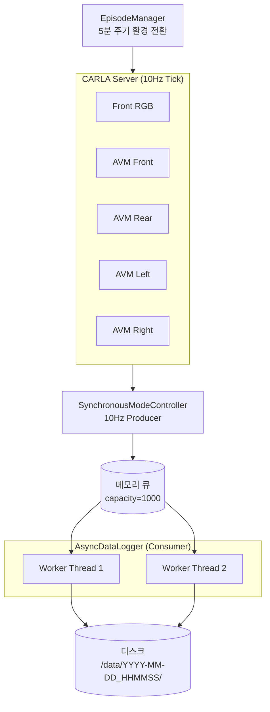

## 1. 개요

Phase 1에서 완성된 데이터 파이프라인은 CARLA 시뮬레이터에서 수집되는 멀티카메라 데이터를 안정적으로 디스크에 저장하기 위해 **Producer-Consumer 패턴**을 채택했습니다. 89개의 단위·통합 테스트가 통과된 상태로, 소규모 팀의 프로젝트로서는 높은 수준의 테스트 커버리지를 확보하고 있습니다.

<!-- more -->

## 2. 아키텍처 다이어그램



## 3. 핵심 컴포넌트

### 3.1 SynchronousModeController

CARLA의 동기 모드를 활용하여 정확한 10Hz 주기로 시뮬레이션을 진행하고 모든 센서 데이터를 캡처합니다. 모든 센서는 동일한 시각의 스냅샷을 공유하므로 시간 동기화가 보장됩니다.

### 3.2 AsyncDataLogger

큐에서 데이터를 받아 디스크에 비동기적으로 저장합니다. 2개의 워커 스레드를 사용하여 디스크 I/O 병목을 완화하고, JPEG 인코딩과 메타데이터(JSON) 저장을 동시에 처리합니다.

### 3.3 EpisodeManager

5분 주기로 날씨와 시간대를 자동 전환하여 데이터의 다양성을 확보합니다. 각 에피소드는 별도 디렉토리로 분리되어 관리됩니다.

## 4. 디렉토리 구조

```
data/
└── 2026-04-22_140523/
    ├── front/
    │   ├── 000001.jpg
    │   ├── 000002.jpg
    │   └── ...
    ├── avm_front/
    ├── avm_rear/
    ├── avm_left/
    ├── avm_right/
    ├── meta/
    │   ├── 000001.json
    │   └── ...
    └── episode.yaml
```

`episode.yaml`에는 날씨, 시간대, 맵 이름, 시작/종료 시각 등 에피소드 메타데이터가 기록됩니다.

## 5. 장애 복원 (Resilience)

| 시나리오 | 대응 |
|---------|------|
| CARLA 서버 크래시 | 큐의 잔여 데이터를 종료 전 플러시(flush) |
| 디스크 I/O 일시 정체 | 큐 버퍼링으로 흡수 (capacity 1000) |
| 잘못된 센서 데이터 | 검증 후 폐기, 카운터에 기록 |
| 클라이언트 강제 종료 | atexit 핸들러로 워커 정상 종료 보장 |

## 6. CLI 사용법

```bash
# 30분간 Town03에서 데이터 수집
python -m src.data_pipeline.cli collect \
  --map Town03 \
  --duration 1800 \
  --output ./data
```
