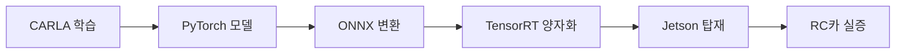

## 1. 개념

**Sim-to-Real Transfer**는 시뮬레이션 환경에서 학습한 정책을 실제 환경(또는 실제 하드웨어)에 적용하는 기법을 말합니다. 시뮬레이션은 데이터 수집 비용·위험·시간을 획기적으로 줄여주지만, 시뮬레이션과 현실 간의 격차(**Reality Gap**)로 인해 직접 전이가 어렵다는 본질적 한계가 있습니다.

<!-- more -->

## 2. Reality Gap의 주요 원인

| 격차 유형 | 설명 |
|----------|------|
| 시각적 격차 | 텍스처, 조명, 렌즈 왜곡 등 카메라 입력 분포의 차이 |
| 동역학 격차 | 차량 무게, 마찰, 서보 응답 등 물리적 동역학 차이 |
| 센서 노이즈 | 실제 센서의 노이즈, 지연, 캘리브레이션 오차 |
| 환경 다양성 | 시뮬레이션이 표현하지 못하는 실제 세계의 다양성 |

## 3. 주요 전략

### 3.1 도메인 무작위화 (Domain Randomization)

학습 시 시뮬레이션의 텍스처, 조명, 색상 등을 무작위로 변화시켜 정책이 환경 변화에 강건해지도록 합니다.

### 3.2 도메인 적응 (Domain Adaptation)

생성 모델(GAN 등)을 활용해 시뮬레이션 이미지를 실제 이미지처럼 변환하거나, 그 반대를 수행합니다.

### 3.3 시스템 식별 (System Identification)

실제 차량의 동역학을 측정하여 시뮬레이션 모델을 보정합니다.

## 4. 숭산텍 프로젝트의 Sim-to-Real 접근

### 4.1 다중 조건 데이터 수집

CARLA에서 9가지 날씨×시간대 조합으로 학습 데이터를 수집하여, 자연스러운 형태의 도메인 무작위화를 수행합니다.

### 4.2 양자화 + 엣지 추론 검증

학습된 모델을 TensorRT로 양자화(FP16/INT8)하여 RC카에 탑재하고, 다음 단계로 검증합니다:

### 4.3 Phase 3-A 실증 연구

> **연구 질문**: "Sim-to-Real 전이에서 데이터의 '절대량(Quantity)'과 '분포의 다양성(Diversity)' 중 무엇이 지배적인 변수인가?"

7가지 데이터 조건을 동일한 ResNet18 아키텍처로 학습하여 Scaling Law를 산출합니다. 이는 학계에서 실증 데이터가 희소한 영역으로, IEEE IV Workshop이나 ICRA 등을 논문 타겟으로 설정합니다.

## 5. 참고 문헌

- [Sim-to-Real Transfer in Deep Reinforcement Learning for Robotics: a Survey (Zhao et al., 2020)](https://arxiv.org/abs/2009.13303)
- [Domain Randomization for Transferring Deep Neural Networks from Simulation to the Real World (Tobin et al., 2017)](https://arxiv.org/abs/1703.06907)
