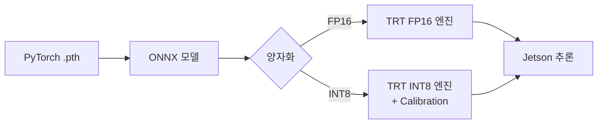

## 1. 개요

**TensorRT**는 NVIDIA의 고성능 딥러닝 추론 최적화 SDK입니다. 숭산텍 프로젝트는 Jetson 환경에서 30Hz 추론 주기를 달성하기 위해 PyTorch 모델을 TensorRT 엔진으로 변환합니다.

<!-- more -->

## 2. 양자화 파이프라인



## 3. 양자화 수준 비교

| 정밀도 | 추론 지연 (Jetson) | 정확도 손실 | 모델 크기 |
|--------|--------------------|-------------|----------|
| FP32 (기준) | ~15ms | baseline | ~45MB |
| FP16 | ~5ms | < 2% | ~23MB |
| INT8 | ~3ms | < 5% (시나리오 의존적) | ~12MB |

## 4. ONNX → TensorRT 변환 예시

```bash
# trtexec를 사용한 FP16 변환
trtexec \
  --onnx=bc_model.onnx \
  --saveEngine=bc_model_fp16.trt \
  --fp16 \
  --workspace=4096
```

INT8 양자화는 대표 데이터셋을 이용한 캘리브레이션이 필요합니다.

```python
import tensorrt as trt

class Calibrator(trt.IInt8EntropyCalibrator2):
    def __init__(self, calib_data_loader, cache_file='calib.cache'):
        super().__init__()
        self.cache_file = cache_file
        self.data = calib_data_loader
        # ...
    
    def get_batch(self, names):
        # 다음 배치를 GPU 메모리에 로드하여 반환
        ...
```

## 5. Phase 3-C 양자화 안전성 연구

> **연구 질문**: "FP32 → FP16 → INT8 양자화 시, 정확도 손실이 '어떤 주행 상황에서' 안전 임계점을 넘어서는가?"

7개 시나리오(직선/커브/교차로 × Clear/Rain/Fog × Day/Night/Backlight) × 3개 모델 = 21회 평가를 통해 양자화 수준 × 시나리오 난이도 **Degradation 히트맵**을 산출합니다.

이 연구는 단순한 성능 측정을 넘어, "어떤 조건에서 INT8이 안전 임계점을 넘는가?"라는 실용적 질문에 답하는 것을 목표로 합니다.

## 6. 참고 자료

- [TensorRT 공식 문서](https://docs.nvidia.com/deeplearning/tensorrt/)
- [NVIDIA Jetson AI Lab](https://www.jetson-ai-lab.com/)
