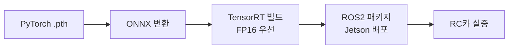
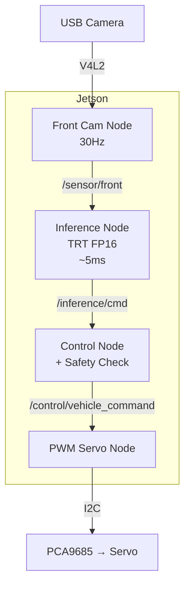

# 엣지 배포 아키텍처

## 1. 개요

학습된 모델을 실제 RC카에서 동작하도록 하는 배포 단계는 Phase 2-C에서 다룹니다. 핵심 요구사항은 **Jetson 환경에서 30Hz 추론 주기를 안정적으로 유지**하는 것입니다.

## 2. 배포 파이프라인



## 3. 하드웨어 구성

| 구성 요소 | 사양 |
|----------|------|
| 메인 컴퓨트 | NVIDIA Jetson Xavier NX (8GB) 또는 Orin Nano |
| 카메라 | USB 카메라 (전방 1대, AVM은 Phase 3+) |
| 차량 | 1/10 스케일 RC카 |
| 서보 컨트롤러 | PCA9685 (I2C, 16채널) |
| 배터리 | 3S LiPo 5,000mAh |

## 4. ROS2 배포 토폴로지



## 5. 안전 정책 (Safety Properties)

설계 문서에는 10개의 명시적 안전 속성이 정의되어 있습니다. 주요 항목은 다음과 같습니다.

| 번호 | 속성 |
|------|------|
| P1 | 추론 결과의 절댓값이 1.0을 초과하면 1.0으로 클리핑 |
| P2 | 30Hz 주기를 200ms 이상 놓치면 비상 정지 발동 |
| P3 | 카메라 입력이 1초 이상 끊기면 비상 정지 |
| P4 | 충돌 감지 센서(범퍼) 신호 시 즉시 정지 |
| P5 | 추론 출력의 NaN/Inf 검출 시 직전 명령 유지 |
| P6 | 최대 속도(throttle)는 안전을 위해 0.3으로 제한 |
| P7 | 조향 변화율은 0.5/tick 이내로 제한 |
| P8 | ROS2 노드 중 하나라도 죽으면 시스템 전체 정지 |
| P9 | 배터리 전압 모니터링, 임계치 이하 시 안전 정지 |
| P10 | 모든 명령은 1ms 이내에 PWM으로 전달되어야 함 |

## 6. 모델 변환 명령

```bash
# 1. ONNX 변환 (개발 머신에서)
python tools/export_onnx.py \
  --checkpoint checkpoints/bc_best.pth \
  --output bc_model.onnx

# 2. Jetson에서 TensorRT 빌드
trtexec \
  --onnx=bc_model.onnx \
  --saveEngine=bc_model_fp16.trt \
  --fp16 \
  --workspace=2048

# 3. ROS2 노드 빌드
cd ros2_ws && colcon build --packages-select sit_inference
```

## 7. 성능 목표

| 메트릭 | 목표 | 측정 방법 |
|--------|------|----------|
| 추론 지연 | < 10ms (95%ile) | rosbag 기록 후 분석 |
| ROS2 제어 주기 | ≥ 30Hz | timer callback 카운트 |
| 직선 주행 거리 | > 10m (충돌 없이) | 실내 직선 코스 |
| 전력 소모 | < 15W | INA219 측정 |
