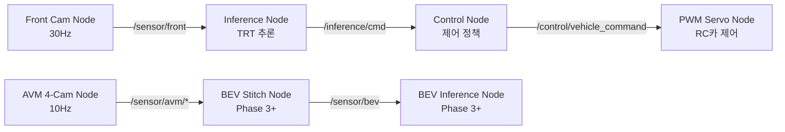

# ROS2 Humble

## 1. 개요

**ROS2(Robot Operating System 2)**는 로보틱스 및 자율 시스템 개발의 사실상 표준 미들웨어입니다. 숭산텍은 LTS 버전인 **ROS2 Humble**(Ubuntu 22.04 기반)을 채택합니다.

## 2. 왜 ROS2인가?

| 특성 | ROS1과의 차이 |
|------|---------------|
| 통신 미들웨어 | DDS 기반 (분산 시스템에 최적) |
| 실시간성 | RT 커널 지원 (자율주행에 필수) |
| 보안 | SROS2를 통한 메시지 암호화 |
| 멀티 플랫폼 | Windows, Linux, macOS 지원 |
| 라이프사이클 | 노드 상태 관리(Configure/Activate/Deactivate) |

## 3. Phase 2-C ROS2 노드 구성



## 4. 주요 노드 명세

### 4.1 Sensor Node (Front Camera)

```python
# camera_publisher_node.py
import rclpy
from rclpy.node import Node
from sensor_msgs.msg import Image
from cv_bridge import CvBridge

class FrontCameraNode(Node):
    def __init__(self):
        super().__init__('front_camera_node')
        self.publisher = self.create_publisher(Image, '/sensor/front', 10)
        self.timer = self.create_timer(1.0/30.0, self.publish_frame)  # 30Hz
        self.bridge = CvBridge()
    
    def publish_frame(self):
        # 카메라 캡처
        frame = self.capture_frame()
        msg = self.bridge.cv2_to_imgmsg(frame, encoding='bgr8')
        self.publisher.publish(msg)
```

### 4.2 Inference Node

TensorRT 엔진을 로드하여 30Hz 주기로 추론을 수행하고, 조향·가속 명령을 발행합니다. 추론 지연은 < 10ms를 목표로 합니다.

### 4.3 Control Node

Inference Node의 출력을 받아 PWM 신호로 변환하여 RC카의 서보 모터에 전달합니다. Safety check (속도 제한, 비상 정지 등)도 이 노드에서 수행합니다.

## 5. 실시간 성능 보장

- **DDS QoS 설정**: `RELIABILITY: BEST_EFFORT`, `HISTORY: KEEP_LAST(1)` 으로 지연 최소화
- **CPU 코어 분리**: `taskset`을 사용한 노드별 CPU 코어 고정
- **메모리 풀 사전 할당**: 동적 할당 회피

## 6. 참고 자료

- [ROS2 Humble 공식 문서](https://docs.ros.org/en/humble/)
- [ROS2 Best Practices](https://docs.ros.org/en/humble/Tutorials/Beginner-CLI-Tools.html)
